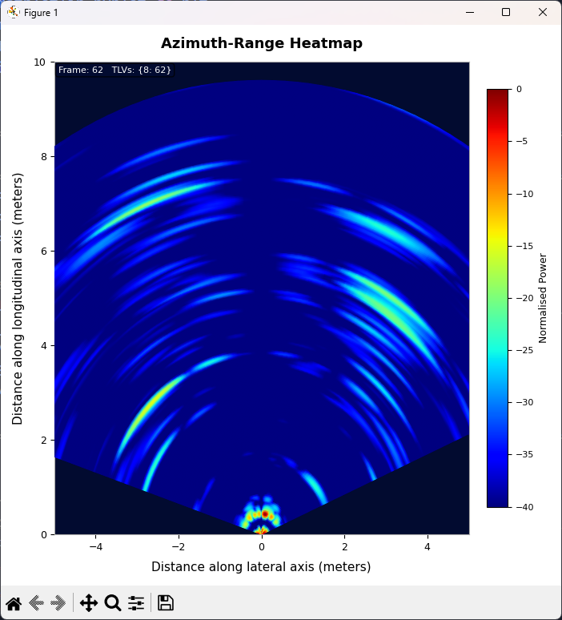
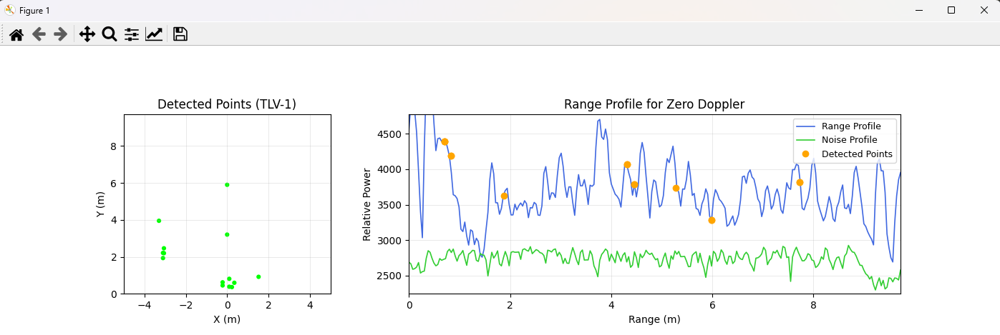

# mmWave Radar Data Visualizer (Python)

This project focuses on processing and visualizing radar data using Python with the AWR1843AOP sensor.

## Features
- Detection of object points (X-Y coordinates)
- Range profile visualization
- Azimuth-Range heatmap generation

## Tech Stack
- Python
- NumPy
- Matplotlib

## Description
This project was developed as part of my learning in radar signal processing and embedded systems. It replicates visualization concepts similar to mmWave radar demo tools.

## Outputs

## Note
This project is built for learning purposes and does not include any proprietary or confidential data.
